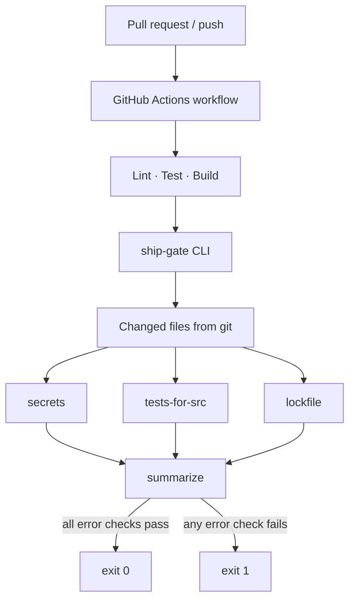

# ship-gate

Policy checks for pull requests, enforced in CI.

ship-gate answers a narrow question before merge: *given this diff, is there an obvious reason not to ship?* It does not replace unit tests, code review, or a full secret-scanning platform. It encodes a small set of merge policies so every author — human or agent — hits the same automated bar.

## Context

Teams adopting AI-assisted development increase PR volume and change velocity. Existing CI usually proves *the codebase still builds and tests pass*. It rarely proves *this change respects delivery policy*.

Those are different failure modes:

| Layer | Typical CI | Gap when velocity rises |
|-------|------------|-------------------------|
| Correctness | unit / integration tests | covered if tests exist |
| Buildability | compile, typecheck, install | covered |
| Delivery policy | often informal | secrets, missing tests for new code, lockfile drift |

ship-gate sits in the third row. The design assumption is that policy should be:

1. **Identical for all authors** — no special path for agent-generated PRs  
2. **Diff-aware** — prefer changed files over whole-repo scans when a base ref exists  
3. **Fail-closed on high-confidence rules** — clear errors, not soft suggestions  
4. **Runnable locally** — same CLI as CI, so developers reproduce failures without pushing  

## Goals and non-goals

**Goals**

- Demonstrate a complete CI path: lint → test → build → policy  
- Keep policies readable and extensible (one module per check)  
- Dogfood the product on this repository’s own workflow  

**Non-goals**

- Compete with Gitleaks, TruffleHog, or Semgrep  
- Enforce coverage percentages or mutation scores  
- Own deployment / CD (staging promote, canary, rollback)  
- Provide org-wide policy-as-code across many languages out of the box  

## Decision: GitHub Actions as the runner

CI/CD is the practice; GitHub Actions is the execution environment for this repo.

**Why Actions here**

- Workflow definitions live next to the code they protect (`/.github/workflows`)  
- PR status checks are the natural merge control surface on GitHub  
- Composite Action (`action.yml`) lets another repo reuse the same CLI without copying YAML  

**Why not a custom runner platform**

A from-scratch webhook → queue → worker stack proves orchestration skills, but it does not improve the *policy* story for this scope. For a reference design aimed at GitHub-hosted teams, Actions is the correct default. The policy engine remains a plain Node CLI so it is not locked to Actions forever.

## Decision: three policies only

Each check exists because it maps to a recurring merge incident, not because it looks good on a checklist.

| Check ID | Rule | Reasoning |
|----------|------|-----------|
| `secrets` | Fail if high-signal secret patterns appear in scanned files | Credentials in a merged PR are expensive to remediate; high-signal regex catches common leaks without pretending to be a vault product. Test fixtures are skipped so intentional examples do not false-fail CI. |
| `tests-for-src` | Fail if `src/` / `lib/` / `app/` source changes without a colocated test | Velocity often adds code without tests. Requiring a sibling `*.test.ts` is a coarse but enforceable proxy for “this change is verified somehow.” Whole-repo mode skips this check; it only applies when `--base` provides a diff. |
| `lockfile` | Fail if `package.json` changes without a lockfile update, or if no lockfile exists | Reproducible installs are a delivery prerequisite. Drift here breaks CI for everyone else later. |

Adding more checks is intentional extension work: new file under `src/checks/`, register in `src/run.ts`, add tests. Prefer few strict rules over many noisy ones.

## Pipeline design

```
on: pull_request | push(main)
  → checkout (fetch-depth: 0)
  → npm ci
  → lint (tsc --noEmit)
  → test
  → build
  → ship-gate --base <base-ref>
```

**Ordering rationale**

1. **Lint/test/build first** — cheap correctness gates; no point evaluating policy on a broken tree  
2. **Policy last** — treats ship-gate as a merge gate, not a substitute for the test suite  
3. **`fetch-depth: 0`** — required so `git diff base...HEAD` is accurate on PRs  

Branch protection (require this workflow) is an operations step in GitHub settings, not something the YAML can fully enforce alone.

## Architecture

```
src/
  cli.ts                 # argv, exit codes, human-readable report
  git.ts                 # changed-file discovery via git diff
  run.ts                 # check registry + summarize
  checks/
    secrets.ts
    tests-for-src.ts
    lockfile.ts
action.yml               # composite Action wrapper around the CLI
.github/workflows/ci.yml # dogfood pipeline for this repo
```



**Local vs PR mode**

| Mode | Invocation | Behavior |
|------|------------|----------|
| Local | `npm run check` | No base ref; secrets/lockfile scan what they can; tests-for-src skips |
| PR / CI | `npx tsx src/cli.ts --base origin/main` | Diff-scoped policy evaluation |

## Trade-offs and limitations

- **Regex secret detection** will both miss clever leaks and occasionally false-positive. Acceptable for a reference policy layer; production orgs should add a dedicated scanner beside this, not instead of thinking about policy.  
- **Colocated-test rule** does not prove test *quality* — only presence. That is deliberate: enforceable beats aspirational.  
- **Node/npm-centric lockfile check** matches this repo’s stack; other ecosystems need parallel rules.  
- **Composite Action installs from `action_path`** — consumers depend on this repo’s `package-lock.json`. Pin a tag/SHA when reusing.

## Run locally

```bash
npm install
npm run ci                              # lint + test + build
npm run check                           # policy, local mode
npx tsx src/cli.ts --base origin/main   # policy, PR mode
```

Exit code `0` = error-severity checks passed. Exit code `1` = at least one failed.

## Reuse in another repository

After this repo is published:

```yaml
# .github/workflows/ship-gate.yml
name: ship-gate
on: pull_request
jobs:
  gate:
    runs-on: ubuntu-latest
    steps:
      - uses: actions/checkout@v4
        with:
          fetch-depth: 0
      - uses: rl000a/ship-gate@main   # pin to a SHA in real use
```

Org-level recommendation: require the workflow as a status check on `main`.

## What this project is evidence of

- Separating **correctness CI** from **delivery policy**  
- Designing merge gates that stay author-agnostic under AI-assisted throughput  
- Implementing a small, testable policy engine and wiring it into GitHub Actions end-to-end  

## Status

🔒 **Proprietary product.** Source is private.

This page is the architecture write-up. Full walkthrough available for the right conversation.
