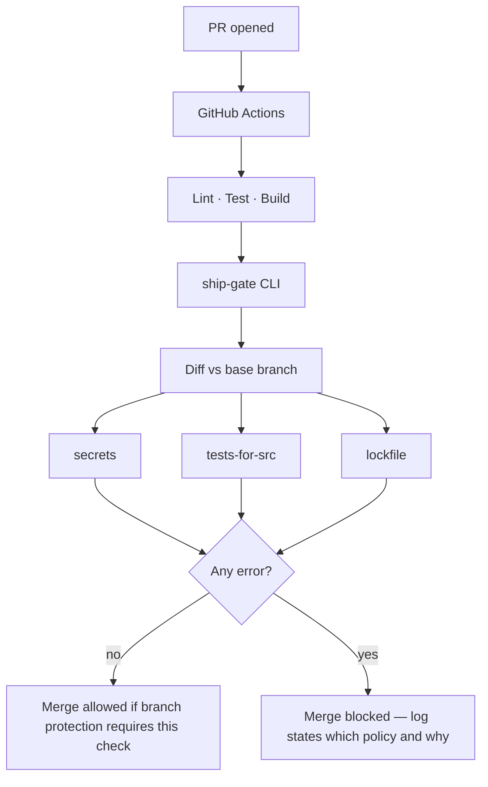

# ship-gate

**The story in one line:** green tests are not the same thing as “safe to merge.”

ship-gate is a small delivery-policy layer that runs in CI. Before a pull request can land, it asks a product question with an engineering answer: *is there an obvious reason this change should not ship?*

---

## The story (PM view)

### Scene

A team ships faster — humans and AI assistants opening more PRs per week. Standups feel good. The board moves. Then something cheap and ugly lands on `main`:

- an API key committed “just for local testing”
- a new module with no test, because “we’ll add coverage next sprint”
- a dependency bump that breaks installs for everyone else on Monday

Nobody intended harm. Review was busy. CI was green. The gap wasn’t competence — it was **missing merge rules**.

### The insight

Most pipelines answer:

> Does the product still *work*?

Fewer pipelines answer:

> Are we allowed to *accept* this change under our delivery rules?

Those are different jobs.

| Question | Owner feeling | Typical tool |
|----------|---------------|--------------|
| Does it still work? | “Quality” | lint, unit tests, build |
| Are we allowed to merge it? | “Governance / risk” | often a wiki, or nothing |

ship-gate is the second column, automated.

### The product bet

**Same bar for every author.**  
If an agent opened the PR, the rules do not relax. If a senior engineer opened it, the rules do not relax. Velocity is allowed; bypass culture is not.

**Few rules, enforced hard.**  
Three checks only. Each maps to a real incident class. Noise trains people to ignore CI — so we prefer a short fail over a long warn list.

**Explainable failures.**  
A PM should be able to read the CI log and understand *what* failed and *why it matters to the release*, not only which regex fired.

### What “ready to merge” means here

A change is merge-ready when:

1. The tree still builds and tests pass *(correctness — standard CI)*  
2. ship-gate finds no policy breach on the diff *(delivery policy — this project)*  

Only then should branch protection allow merge.

```
Idea → PR → [ build & tests ] → [ ship-gate policies ] → merge
                              ↑                         ↑
                         “does it work?”         “may we accept it?”
```

---

## What it checks (and why a PM should care)

| Check | Plain-language meaning | Failure cost if skipped |
|-------|------------------------|-------------------------|
| **secrets** | “Did this PR try to commit credentials?” | Incident, rotation, trust hit |
| **tests-for-src** | “Did we change product code without adding a test next to it?” | Silent regressions, review theater |
| **lockfile** | “Did we change dependencies without freezing the install?” | ‘Works on my machine,’ broken CI for others |

These are not a full security program. They are **release hygiene** — the minimum you want before “LGTM.”

---

## Technical design

### Separation of concerns

| Layer | Responsibility | In this repo |
|-------|----------------|--------------|
| Correctness CI | lint, test, compile | `npm run lint` · `npm test` · `npm run build` |
| Delivery policy | merge rules on the diff | `ship-gate` CLI |
| Runner | when/where jobs execute | GitHub Actions |
| Enforcement | cannot merge on red | branch protection (repo setting) |

CI/CD is the practice. GitHub Actions is the host. ship-gate is the policy engine. Do not collapse those three in conversation — PMs and engineers mean different things when they say “CI failed.”

### Why a CLI (not only YAML)

Policy lives in TypeScript modules under `src/checks/`. The workflow only invokes them.

**Reasoning:** YAML is a good orchestrator and a bad place to grow business rules. A CLI can run locally (`npm run check`) with the same logic CI uses, so a developer reproduces a red build without pushing. Actions becomes a host, not the product.

### Pipeline (dogfooded on this repo)

```
on: pull_request | push(main)
  → checkout (full history)
  → npm ci
  → lint → test → build
  → ship-gate --base <base-ref>
```

**Ordering**

1. Correctness first — no policy evaluation on a broken tree  
2. Policy last — merge gate, not a substitute for tests  
3. `fetch-depth: 0` — `git diff base...HEAD` must see real history  

Workflow: [`.github/workflows/ci.yml`](.github/workflows/ci.yml)  
Reusable wrapper: [`action.yml`](action.yml)

### Architecture

```
src/cli.ts           entry, reporting, exit codes
src/git.ts           changed files via git diff
src/run.ts           check registry + summarize
src/checks/*.ts      one policy per module
```



### Policy mechanics (depth)

**Diff-scoped when possible**  
With `--base origin/main`, checks operate on `git diff --name-only base...HEAD`. That keeps signal on *this change*, not the whole history. Without a base (local smoke run), `tests-for-src` skips; secrets/lockfile use a bounded path set.

**Fail-closed, high confidence**  
Only `error` severity blocks the build. We deliberately under-claim: regex secrets are not Gitleaks; colocated tests are not coverage %. Enforceable beats aspirational.

**Author-agnostic**  
No `if: actor == bot` relaxations. Agent throughput is a load multiplier on the same trust model, not a second trust model.

Design record: [`docs/DECISIONS.md`](docs/DECISIONS.md)

### Trade-offs (say these out loud)

- Secret patterns will miss clever leaks and can false-positive — pair with a dedicated scanner in production  
- “Test file exists” ≠ “test is good” — that is intentional scope  
- Lockfile rule is Node-ecosystem shaped — other stacks need parallel checks  
- Reusing the Action: pin a commit SHA; do not float on `@main` in serious orgs  

---

## Run it

```bash
npm install
npm run ci                              # correctness
npm run check                           # policy, local mode
npx tsx src/cli.ts --base origin/main   # policy, PR mode
```

| Exit code | Meaning |
|-----------|---------|
| `0` | error-severity policies passed |
| `1` | at least one policy failed |

### Use from another repo

```yaml
# .github/workflows/ship-gate.yml
name: ship-gate
on: pull_request
jobs:
  gate:
    runs-on: ubuntu-latest
    steps:
      - uses: actions/checkout@v4
        with:
          fetch-depth: 0
      - uses: rl000a/ship-gate@main   # pin SHA in real use
```

Then require the check on `main` under branch protection. Without that setting, red CI is advisory only.

---

## What this demonstrates

For a product conversation: *we automated “may we accept this change?” so speed does not invent a second, weaker merge path.*

For a technical conversation: *correctness CI and delivery policy are separate layers; policy is a tested CLI; Actions is the host; the pipeline dogfoods itself.*
